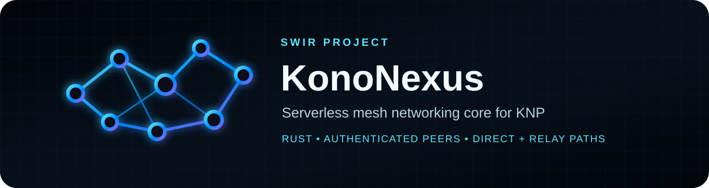

<!-- SWIR-README-STANDARD:v2 -->

<div align="center">



<br>


**KonoNexus** is an experimental, serverless mesh-networking core for the **KonoNexus Protocol (KNP)**.

[**Highlights**](#-highlights) · [**Quick Start**](#-quick-start) · [**Roadmap**](#roadmap) · [**Testing**](#testing-candidate)

</div>

## Project status

| Item | Status |
|---|---|
| Current stage | Alpha / controlled network-testing candidate |
| Source version | `0.1.0-alpha.28` |
| Roadmap | **46 / 49 = 93.9%** |
| Core | Rust 2021 |
| Current tester focus | Windows two-PC Internet testing |
| License | MIT |

> Local or CI success is **not** proof of universal Internet, NAT or CGNAT connectivity. The tester reports the actual selected path and evidence; real multi-network validation remains an open gate.

## Overview

KonoNexus is designed so applications such as Konofix can communicate without depending on a permanent central application server, VPS, hosted API or single relay provider. Running nodes can participate as endpoints and, where explicitly established by the protocol, as bounded cooperative relays for other authenticated peers.

Node identity comes from cryptographic keys rather than an IP address. Direct transport is preferred, while encrypted relay paths provide a controlled fallback when direct traversal cannot be established.

## ⚡ Highlights

| Feature | What it does |
|---|---|
| 🔐 Cryptographic peer identity | Uses persistent Ed25519 identity and authenticated session establishment. |
| 🔄 Direct + relay transport | Prefers direct KNP sessions and can use bounded cooperative relay circuits as a fallback. |
| 🧭 Decentralized rendezvous | Existing encrypted peers can coordinate a direct-path attempt without becoming permanent infrastructure. |
| 🗺️ Bounded DHT discovery | Signed peer records and bounded recursive lookup operate over authenticated mesh edges. |
| ♻️ Path migration | Application traffic can migrate between confirmed direct and established relay paths. |
| 🛡️ Replay / abuse controls | Bounded windows, quotas, TTLs and admission rules constrain protocol state and forwarding. |
| 🪟 Network Tester | Provides a Windows GUI for controlled two-PC Internet testing and path diagnostics. |
| 🧪 Runtime harnesses | Automated tests cover authenticated multi-node runtime paths without claiming WAN evidence. |

## 🚀 Quick Start

### From source

Requirements: a current Rust toolchain with Cargo and the platform dependencies required by the Rust crates in this repository.

```bash
git clone https://github.com/Swir/KonoNexus.git
cd KonoNexus
cargo run -- --help
```

Run the automated Rust test suite before experimenting with network scenarios:

```bash
cargo test
```

For controlled multi-machine testing, follow [`docs/TESTING.md`](docs/TESTING.md) rather than treating loopback or CI results as Internet proof.

### SDK-only dependency

Downstream applications can depend on the library without pulling in the Network Tester GUI stack:

```toml
[dependencies]
kononexus = { git = "https://github.com/Swir/KonoNexus.git", default-features = false }
```

The default `tester-gui` feature keeps the tester enabled for normal builds. Disable default features for SDK integration; for example, `cargo check --no-default-features --lib` checks only the core library without `eframe`, `arboard` or `image`.
Production consumers should also pin `rev` to an exact reviewed commit instead of following a moving branch.

Native hosts that need a language-neutral boundary can use the strict, versioned JSON SDK bridge documented in [`docs/SDK-BRIDGE.md`](docs/SDK-BRIDGE.md). The packaged `kononexus_sdk_host` process keeps one transport alive and exchanges one request, response or event per JSON line. It does not alter the public KNP network wire format or by itself complete the Windows/Android application integrations.

## Requirements / compatibility

- **Core:** Rust 2021.
- **Primary development targets:** Windows and Linux.
- **Windows tester:** intended for controlled two-PC validation.
- **Networking:** UDP reachability and NAT behavior vary by network; no universal NAT/CGNAT success is claimed.
- **Android transport:** planned, not yet complete.
- **Security:** pre-release protocol/security work has automated coverage but no claim of independent security review.

## Usage

The CLI supports explicit peers, NodeID-based connection attempts, bounded rendezvous, DHT-assisted discovery, relay paths and controlled filtering-evidence tests. Use `cargo run -- --help` for the current command surface.

The examples below document protocol flows that are already present in this branch; keep production expectations bounded by the limitations and testing notes.

## Releases

There is **no stable KonoNexus 1.0 release yet**. The active source/testing candidate is `0.1.0-alpha.28`. Release readiness depends on the remaining roadmap, integration and real multi-network evidence rather than source-only CI.

## Principles

- **No central authority in the data path.**
- **Every node is equal.** There is no permanent "master" node.
- **Self-healing topology.** Future routing will choose alternate peers when a path disappears.
- **End-to-end privacy.** Relay nodes must never need plaintext application data.
- **Cryptographic identity.** A node identity is derived from its public key, not from an IP address.
- **Portable core.** The networking core is written in Rust for Windows/Linux first, with Android integration planned.
- **No custom cryptography.** KNP composes established cryptographic primitives rather than inventing new ciphers.

## What works now

Two admitted peers can establish an authenticated X25519/HKDF/ChaCha20-Poly1305 session. Each `HELLO_ACK` also contributes an independent observation of the local node's externally visible UDP endpoint.

With at least two observers, KNP can currently distinguish whether those observations look:

- stable,
- stable-address but port-varying,
- address-varying.

This is **mapping-behavior evidence**, not a claim to fully identify every NAT/filtering type.

### Experimental decentralized rendezvous

A normal KonoNexus node that already has encrypted sessions with peers A and B can temporarily coordinate a direct-path attempt:

```text
A ===== encrypted ===== C ===== encrypted ===== B
           request      |       offers
                        |
A -------- signed PUNCH_PROBE / ACK -------- B
```

C is not a fixed service. It is just another running KonoNexus peer and does not become a permanent dependency after a direct A↔B path is established.

For controlled tests, A can still name a coordinator explicitly:

```bash
cargo run -- \
  --peer COORDINATOR_IP:47000 \
  --rendezvous COORDINATOR_IP:47000=TARGET_KNP_NODE_ID
```

Automatic mode only needs the target NodeID. It now runs both bounded rendezvous selection and encrypted DHT lookup:

```bash
cargo run -- --peer KNOWN_PEER:47000 --connect-node TARGET_KNP_NODE_ID
```

KNP then tries at most three currently encrypted peers per round as coordinators, avoids repeating them in the same round, and backs off before another round.

Explicit `connect()` hints and independently attested exact DHT results now enter one NodeID-bound candidate plan. The plan preserves source priority, deduplicates endpoints, tries native IPv6 first while reserving an exact IPv4 fallback within the three-address bound, uses a four-second stagger, expires after 30 seconds, and never derives adjacent addresses or ports. Only the attempted address is admitted as an expected source; a different signed NodeID is rejected before peer admission. When both families establish authenticated sessions, runtime retains one endpoint per family, migrates application traffic to native IPv6, and falls back to the authenticated IPv4 session if IPv6 disappears. A confirmed encrypted direct session cancels the remaining candidate, punch, rendezvous and pending relay work for that target. If exact candidates fail, KNP exhausts one bounded round of at most three authenticated rendezvous coordinators before relay fallback becomes eligible.

Both A and B must already have an encrypted KNP session with that coordinator. The coordinator sends each side the UDP source endpoint it currently observes for the other side. Each side waits briefly, then emits a locally bounded seven-probe backoff burst over roughly 2.7 seconds while the signed punch authorization remains valid for five seconds. A successful `PUNCH_PROBE/PUNCH_ACK` stops the schedule, establishes the authenticated direct endpoint, and starts a fresh encrypted KNP session over it.

This is an experimental primitive. NATs that create destination-specific mappings can still defeat this strategy; cooperative relay is the later fallback.

## Roadmap

**Verified roadmap progress:** 46 / 49 items complete (**93.9%**). This number is derived from the checklist below and reflects implemented protocol/state-machine behavior; local tests do not close the separate real-network validation gate.

- [x] KNP wire envelope and protocol versioning
- [x] Persistent Ed25519 node identity
- [x] Signed discovery and bounded replay protection
- [x] Stateless anti-amplification endpoint cookies
- [x] Authenticated X25519 session handshake
- [x] Bounded SessionInit retransmission + cached responder ACK
- [x] HKDF-SHA256 directional session keys
- [x] ChaCha20-Poly1305 encrypted secure frames
- [x] Peer-reported external UDP endpoint observations
- [x] Bounded NAT mapping-behavior profile
- [x] Experimental decentralized rendezvous messages
- [x] Signed UDP punch probe/ack primitive
- [x] Multi-attempt timed hole-punch burst/state machine
- [x] Consent-based endpoint-independent filtering evidence test
- [x] Broader filtering-behavior matrix and negative-result interpretation
- [x] Multi-candidate/path prioritization without unsafe port spraying
- [x] Bounded automatic selection of encrypted rendezvous peers
- [x] IPv6 direct-path preference
- [x] Signed bounded DHT peer records and encrypted exact lookup
- [x] Bounded recursive multi-hop DHT over encrypted peers
- [x] In-memory k-bucket-style routing table
- [x] Persistent authenticated-peer routing hints across restarts
- [x] Persistent full bounded k-bucket state across restarts
- [x] Large-mesh convergence and churn validation (32-node localhost runtime)
- [x] Single-hop cooperative relay circuit/control foundation
- [x] Bounded opaque relay cell forwarding
- [x] Authenticated end-to-end inner session over relay
- [x] Live async RelayApp send/receive handle
- [x] 512-byte relay application fragmentation and bounded reassembly
- [x] ACK-based bounded outbound backpressure
- [x] Automatic hole-punch → single-relay fallback via rendezvous coordinator
- [x] Relay per-node and bandwidth abuse quotas
- [x] Bounded fragment/ACK retransmission and duplicate-delivery suppression
- [x] RelayApp delivery-failure callbacks
- [x] Sliding 128-sequence anti-replay windows with UDP reordering tolerance
- [x] Bounded alternate relay selection across up to 3 encrypted peers
- [x] Live RelayApp direct↔relay migration with direct preference
- [x] Multi-relay routing and full control-plane path migration
- [x] Runtime path scoring integrated with self-healing routing
- [x] KonoMind advisory scaffold
- [x] KonoMind local learning from authenticated runtime NAT/relay outcomes
- [x] Direct KNP session key rotation with 30-second grace window
- [x] Relay-inner E2E session key rotation
- [x] Three-node live runtime mesh harness
- [ ] Real multi-network/NAT test matrix
- [x] KonoNexus Network Tester GUI
- [x] Konofix SDK transport wrapper
- [ ] Konofix Windows application integration
- [ ] Android transport integration

See [docs/KNP-SPEC.md](docs/KNP-SPEC.md) and [docs/THREAT-MODEL.md](docs/THREAT-MODEL.md).

## KonoMind

KonoMind remains advisory-only. Authenticated RelayApp ACKs and bounded delivery-failure outcomes now update persistent per-path local learning from the actual route and measured RTT or timeout; learned relay quality feeds later route scoring. It cannot bypass KNP cryptographic or admission rules, and this runtime wiring does not replace the separate real multi-network/NAT validation gate.

## Why a seed is still needed

A completely new node cannot discover an existing global mesh from nothing. It needs at least one reachable peer address, cached peer, invite, LAN discovery result, or later a DHT-derived record. No permanent central bootstrap service is required by the protocol.

## Security note

KonoNexus is pre-release networking/security software. Its security and NAT traversal designs have automated tests but have not undergone independent review. Do not treat an alpha build as production-ready.

## License

MIT

### Consent-based filtering matrix

A controlled positive filtering-evidence test can be requested through a coordinator:

```bash
cargo run -- --peer COORDINATOR_IP:47000 --filter-test COORDINATOR_IP:47000
```

One consented trial records three separately authorized source relationships against the exact public endpoint already observed by the coordinator:

- **contacted endpoint control** — the coordinator sends from its already-contacted endpoint,
- **same address, different port** — the coordinator sends one datagram from a temporary source port on the same IP address,
- **different, previously uncontacted address** — an independent helper whose source IP is absent from the tested node's bounded recent-egress history and direct-peer set sends one datagram.

The tested node signs a short-lived Ed25519 authorization binding its NodeID/public key, target endpoint, coordinator and baseline endpoint, helper, source class, trial ID, and random probe token. Probes are one-shot, source relationships are checked against the class, and authorization, pending-state, replay, rate, and evidence lifetimes are bounded.

Only a successfully observed probe is positive evidence for its cell. A timeout, unavailable helper, or local send failure is retained as an explicitly **inconclusive** result; none proves restrictive filtering. Loopback and CI tests validate protocol logic only. They are not WAN, NAT, or CGNAT evidence, so the separate real multi-network/NAT test-matrix roadmap gate remains open.

### Signed DHT discovery foundation

Each node may publish a short-lived `PeerRecord` containing its NodeID, Ed25519 public key, a small set of public UDP endpoints, issue/expiry times, and a signature. Records are accepted only when the NodeID matches the public key, the signature verifies, the TTL is bounded, and every endpoint passes publishability checks.

DHT control messages travel inside the existing encrypted KNP session:

- `DHT_STORE` — share a signed peer record with bounded matching endpoint evidence,
- `DHT_ATTESTATION` — return a short-lived endpoint observation signed by an authenticated peer,
- `DHT_FIND` — ask for a target NodeID,
- `DHT_NODES` — return the exact record when known plus a bounded nearest-record set.

The local table is bounded to 4,096 records and responses to at most 8 records plus 4 matching attestations. Records and evidence expire automatically. KNP may cache nearest records, but it **does not automatically dial arbitrary nearest nodes**. A new network connection is attempted only from an exact valid record for a NodeID that the local user/application is already trying to reach, and only when one exact endpoint has current signatures from at least two independent observer identities.

This remains an intentionally bounded DHT rather than a complete Kademlia implementation. Multi-hop lookup, persistent bounded k-bucket snapshots, endpoint-attestation exchange/enforcement, bounded replica refresh, and observed-prefix diversity are implemented. Prefix diversity raises the cost of a single-network routing takeover; it is not Sybil resistance. A 32-node localhost runtime test exercises convergence, churn, exact lookup, and application delivery; it is not WAN, NAT, or CGNAT evidence. Independent-operator diversity remains future work.

### Bounded multi-hop DHT

Alpha.8 adds an in-memory 256-bucket routing table. A peer enters or refreshes this table only after a frame decrypts successfully under the session-bound NodeID. Each bucket stores at most 8 active peers and at most 2 peers from one observed IPv4 `/24` or IPv6 `/48`; IPv4-mapped IPv6 is normalized to IPv4. Nearest-peer selection takes one peer per observed prefix before deterministically filling any remaining slots from duplicate prefixes, preserving availability when only one prefix exists.

A lookup is recursive but deliberately bounded:

- fanout: at most 2 encrypted peers per hop,
- depth: at most 3 hops,
- query timeout: 8 seconds,
- retry delay: 5 seconds,
- duplicate queries are suppressed with a bounded seen-query cache,
- intermediate nodes keep a short-lived reverse route so encrypted `DHT_NODES` results can travel back toward the origin.

The lookup walks only existing encrypted mesh edges. It does **not** open connections to arbitrary nearest records returned by gossip. A new outbound discovery attempt still requires an exact, valid signed record for the NodeID the local application explicitly requested.

### Persistent routing buckets

KNP persists the complete bounded routing-table membership snapshot in `routing-cache.json`: bucket index, peer NodeID, endpoint, and last-seen time. The snapshot is bound to the local NodeID, validates bucket membership on load, rejects stale/future entries, preserves the 8-entry and 2-per-observed-prefix limits for each of 256 XOR-distance buckets, and deduplicates NodeIDs and endpoints independently. Version-1 flat routing-hint files remain readable and pass through the same normalization before migration on the next save.

Restart never restores authentication from disk. Only the 256 freshest cached endpoints are used as bounded bootstrap hints; every peer must pass signed HELLO, endpoint-cookie admission, identity verification, and a fresh X25519 session handshake before it can re-enter the live routing table. The cache is metadata, not secret key material. Operators can override its path with `--routing-cache`.

### Cooperative relay foundation

A node may request a relay circuit with:

```bash
cargo run -- --peer RELAY_IP:47000 --relay-via RELAY_IP:47000=TARGET_KNP_NODE_ID
```

The relay must already have encrypted KNP sessions with both endpoints. Circuit setup follows `OPEN → OFFER → ACCEPT → READY`. The relay stores at most 256 circuits, expires idle circuits after 120 seconds, validates endpoint identity on both sides, and rejects sequence rollback/replay.

Relay data is carried as `RelayCell` with at most 3 KiB of **opaque bytes** per cell, sized to remain within the 16 KiB outer KNP datagram after nested encryption/hex framing. The relay forwards those bytes without interpreting their application meaning. Alpha.10 layers a separate authenticated inner session inside those opaque cells. The inner handshake is signed with each endpoint's Ed25519 identity, bound to the circuit ID and both NodeIDs, and derives fresh X25519/HKDF/ChaCha20-Poly1305 keys. The relay therefore cannot derive the endpoint-to-endpoint session keys. RelayApp and the `KonofixTransport` SDK wrapper expose authenticated application data over this inner session. The bounded application control-plane migrates that traffic across direct and multiple established relay paths; unrelated outer KNP maintenance messages are not tunneled through relay-inner cells.

### Automatic direct → punch → relay fallback

For a requested NodeID, KNP still prefers a direct authenticated session. If rendezvous is required, it performs the bounded UDP punch burst first. When that punch schedule expires without confirmation, the two endpoints use NodeID ordering so only one side initiates fallback. If the rendezvous coordinator is still connected with an encrypted KNP session, that node requests a cooperative relay circuit through the same coordinator.

After `RelayReady`, the lower NodeID starts the signed inner E2E handshake. Once the handshake completes, an encrypted inner PING/PONG confirms that the relay path carries data the forwarding node cannot decrypt. A failed relay request does not mark the target as authenticated or connected.

### RelayApp application API

Before starting the node, an application can request a bounded runtime handle:

```rust
let mut node = KonoNode::bind(identity, bind, peers, interval).await?;
let mut app = node.configure_relay_app_handle(64)?;

// Run `node.run()` on the network task.
// From the application task:
let message_id = app.send(target_node_id, payload).await?;
if let Some(message) = app.recv().await {
    // message.peer_node_id, message.message_id, message.data
}
if let Some(failure) = app.recv_failure().await {
    // failure.peer_node_id, failure.message_id, failure.reason
}
```

The command/event channels are bounded; application send calls wait for command-channel capacity rather than creating an unbounded queue. The internal outbound queue accepts at most 64 messages / 2 MiB and keeps a sent message allocated until the remote E2E endpoint returns `RelayAppAck`. Incoming messages are limited to 256 KiB each, use 512-byte fragments, allow at most 64 concurrent reassemblies / 4 MiB reserved reassembly memory, and expire incomplete state after 30 seconds. Completed messages are also kept in a bounded queue if the application event channel is temporarily full.

Alpha.12 retransmits the complete fragment set after a 1-second ACK timeout, up to four times. The receiver keeps a bounded delivered-message ID cache so a lost ACK causes ACK replay without duplicate delivery to the application. All encrypted session and relay-transport receive paths use a 128-sequence sliding window: authenticated frames inside the window may arrive out of order, while duplicates and frames older than the window are rejected. Outbound messages still have a 120-second hard TTL.

### Relay abuse controls

Alpha.12 limits a relay to 256 circuits globally and at most 16 circuits involving any one NodeID. Each circuit direction is capped at 128 relay cells per second and 256 KiB per second. The counters reset on a one-second window and apply before forwarding. These limits are protocol safety defaults, not final production tuning.

### Session handshake reliability

Alpha.13 retransmits the same `SESSION_INIT` after a one-second timeout, up to four total attempts. The initiator keeps the same handshake ID and ephemeral X25519 public key across retries. A responder caches the first matching `SESSION_ACK` for ten seconds and re-sends that exact ACK when the same `(endpoint, handshake_id, initiator key)` is seen again, avoiding key mismatch from duplicate initializers. The responder does not flush encrypted application/control work until it receives the first authenticated encrypted frame, which acts as confirmation that the initiator actually received the ACK and derived the same session.

### Alternate relay selection

When direct UDP punching fails, the preferred relay remains the rendezvous coordinator that helped produce the punch candidate. If that relay is gone, cannot open the target, or rejects the circuit, the lower-NodeID endpoint can try other already-authenticated encrypted peers. Alpha.13 tries at most three distinct relay candidates in a 30-second fallback state, never repeats the same candidate, and stops as soon as a direct or relay path to the target becomes active.

### Bounded multi-relay control-plane migration

Application traffic now uses a bounded control-plane selector across confirmed direct KNP sessions and already-established relay E2E circuits. Direct transport preempts relay; otherwise relay selection is deterministic and sticky, considers at most three established circuits, and migrates to another usable relay after close/reject/send failure without redundant circuit setup. A stale relay-path record without its authenticated E2E session cannot suppress bounded recovery. The selector does not probe arbitrary ports or create new unauthenticated paths. See [docs/CONTROL-PLANE-ROUTING.md](docs/CONTROL-PLANE-ROUTING.md) for the invariants and test scope.

### Direct and relay-inner session key rotation

Alpha.14 rotates confirmed **direct KNP sessions** using a fresh ephemeral X25519 exchange carried inside the already authenticated encrypted session. Only the lexicographically lower NodeID initiates periodic rekey, avoiding simultaneous competing rotations. Rekey starts after roughly 10 minutes, retries every second for at most four sends, and reuses the same rekey ID and initiator ephemeral key across retries.

The responder returns the matching new X25519 public key over the old authenticated session, caches the ACK briefly for duplicate retries, and then switches to the newly derived HKDF/ChaCha20-Poly1305 session. Both endpoints retain the previous session for a 30-second grace window so authenticated packets already in flight under the old session ID can still be decrypted. New ordinary traffic uses the new session immediately.

Relay-inner E2E sessions use the same bounded fresh-X25519 rotation pattern: lower-NodeID initiation, one-second retry cadence with at most four sends, cached responder ACKs, and a 30-second previous-session grace window. The relay forwards opaque cells and never receives the endpoint-to-endpoint derived keys.

### Live direct ↔ relay application migration

RelayApp queues are keyed by peer NodeID, not by a socket or circuit. Alpha.14 therefore selects a transport at send time:

1. a confirmed direct encrypted session is preferred;
2. otherwise an established relay E2E path is used;
3. if neither exists, the message remains queued/backpressured until a path becomes available or its existing delivery timeout policy fires.

Fragment reassembly, message IDs, retries, deduplication, and ACKs are path-independent. A message may begin through relay and continue/retry through direct transport after a direct session appears, or fall back to relay if the direct session disappears. The relay circuit may remain available as a hot fallback until its normal idle expiry.

## Testing candidate

Alpha.26 is the current build state intended for controlled testing on separate computers.

The Windows GUI writes an Ed25519-signed JSON result after every completed test. The bundled console probe independently verifies each result, combines two reciprocal fresh reports into a matrix-row bundle, and collects unique row bundles into a deterministic seven-scenario manifest. The manifest rejects reused endpoint reports and reports missing or ineligible scenarios. `MANUAL_REVIEW_READY=1` means the evidence set is complete enough for human review; it never closes the roadmap gate automatically. Scenario and network labels remain operator-supplied metadata, while the embedded endpoint reports are independently signed.

Automated CI now includes a live three-node runtime harness:

- node B and node C bootstrap through node A,
- all nodes perform real signed discovery/cookie/session setup,
- B sends an application message addressed only by C's NodeID,
- KonoNexus discovers/builds the path,
- C receives the authenticated/decrypted RelayApp payload,
- B receives the delivery receipt.

CI also runs a 32-node localhost KonoNode runtime test: 30 leaves bootstrap to two hubs, and the hubs learn their leaf peers through signed HELLO/cookie admission. Nodes establish authenticated encrypted sessions, exchange endpoint observations and independently signed attestations, and publish bounded signed DHT records. The test delivers between non-neighbor leaves before churn, stops every third node, waits for HELLO-based peer expiry and survivor reconvergence, then delivers between a second leaf pair and checks bounded state. Its counters record accepted attestations and signed DHT stores, plus query-correlated FIND/NODES handlers for lookups that need them. The cfg(test)-only DHT exception registers only the exact ephemeral loopback endpoints; production `endpoint_publishable` continues to reject loopback.

This validates one local runtime topology and localhost UDP behavior. It does not establish behavior across WANs, NATs, carrier networks, or CGNAT, and it does not establish Sybil-resistant observer diversity.

The three-node SDK harness uses an explicit **local-test mode** only because loopback addresses are intentionally rejected by production rendezvous security. Local-test mode defaults to `false` and is enabled only by the test harness.

The next validation phase must use separate machines/networks and will check:

1. direct public/IPv6 path when available,
2. ordinary NAT + UDP hole punching,
3. different NATs / mobile hotspot,
4. CGNAT or restrictive NAT causing cooperative relay fallback,
5. direct↔relay migration while messages remain queued,
6. reconnect/restart with persistent bounded routing buckets,
7. delivery receipts/failures under temporary packet loss.

See `docs/TESTING.md` for the controlled operator procedure.

## 🔎 Search Keywords

`serverless mesh networking` • `rust p2p networking` • `decentralized networking` • `udp hole punching` • `nat traversal` • `encrypted relay network` • `x25519 ed25519 chacha20poly1305` • `distributed hash table rust` • `peer to peer windows` • `peer to peer linux` • `kononexus protocol` • `knp networking`

<div align="center">

### `CONNECT • AUTHENTICATE • ROUTE • RECOVER`

⭐ **If KonoNexus is useful, consider leaving a star.**

[**← SWIR profile**](https://github.com/Swir) · [**All projects →**](https://github.com/Swir?tab=repositories)

</div>
